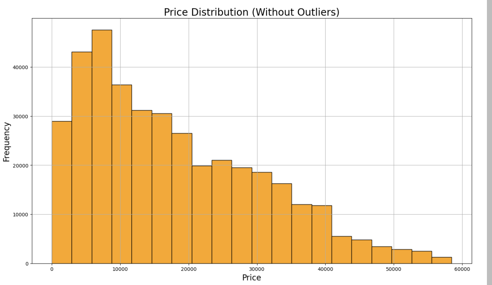

# UsedCarPricePrediction

##Overview :

In this application, we explore a dataset from Kaggle. The provided dataset vechicles.csv contains information on 426K cars. Our goal is to understand what factors make a car more or less expensive by applying various machine learning techniques, explore the factors that influence car pricing. As a result of this analysis, we need to provide recommendations of the car to the customer. 

## Dataset

The dataset contains information on 426K used cars, includes various features such as:
* ID: 
     - A unique identifier for each vehicle, typically irrelevant for price prediction since it does not have a direct relationship to price.
* Year: 
     - The manufacturing year of the vehicle; newer cars usually have higher prices due to less depreciation.
* Manufacturer:
    - The brand of the car, where certain brands often command higher prices due to reputation and demand.
* Model:
    - The specific model of the car, which significantly influences the price based on features, popularity, and demand.
* Condition:
    - The overall state of the vehicle (e.g., excellent, good, poor), with better conditions leading to higher prices.
* Fuel Type: 
    - The fuel type (e.g., gasoline, diesel, electric) can impact the price based on fuel efficiency, emissions, and buyer preferences.
* Odometer:
     - The car's mileage; lower mileage typically indicates less wear and tear, resulting in a higher price.
* Title: 
     - The title status (e.g., clean, salvage) affects price, with a clean title generally resulting in a higher price than a salvage or rebuilt title.
* Size: 
    - The physical size or class of the car (e.g., compact, sedan, SUV), where size can impact pricing based on consumer demand.
* Drive Type: 
    - Whether the car is front-wheel drive (FWD), rear-wheel drive (RWD), or all-wheel drive (AWD), which can affect pricing due to performance and regional preferences.
* Vehicle Type: 
    - The type of vehicle (e.g., sedan, truck, SUV) that influences the price based on its popularity and functionality.
* Paint Color:
    - The color of the car, which can affect its appeal and price, with some colors being more desirable or popular than others.
* State: 
    - The state where the vehicle is located or sold, as regional factors like market demand, taxes, and climate can affect price.

## Files 

* prompt_II.ipynb: The Jupyter Notebook containing the complete analysis, data preparation, modeling, and evaluation process.
* vehicles.csv: The dataset used for training and testing the machine learning models.

## Data Understanding :

* Load the dataset
* Check data type of the columns and dimensions of the dataframe
* Check the null values and duplicate rows
* Remove rows with a price value 0 and convert the 'price' column to integer
* Replace NaN values in the 'year' column with the mean value
* Find unique values condition, title_status, drive and replace NaN values
* Print price outliers to understand data
* Replace NaN values in the 'year' column with the mean value

## Data Preparation :

* Drive, Condition, and Title columns were one-hot encoded to transform categorical data into numerical format for machine learning model
* Generate a int columns for each unique category, allowing the model to interpret these features as separate variables with values 0 or 1.
* The encoded features enhance the model’s ability to capture the impact of these attributes on used car price predictions.
* Drop the cloumns Type, ID, Size, Drive, Condition, and Title.
* Calculate IQR for price, odometer and remove outliers
* Univariate Analysis
     -  Plots
    
   
    
    
* Bivariate Analysis
     - Plots 
        * Year vs. Price: Newer cars typically have higher prices, with older cars experiencing depreciation over time.
       
     
     
            * Odometer vs. Price: Lower mileage generally correlates with higher prices since cars with fewer miles are considered less worn out.
  
      
     
            *  The heatmap visually represents the correlation between the selected variables (price, year, odometer, and drive types), with values ranging from -1 to 1, where darker colors indicate stronger correlations and lighter colors represent weaker correlations.
   
             

## Modeling :

* Linear Regression:
    * Performance:
    * MSE = 85,255,951
    * MAE = 6,863
    * 𝑅2 = 0.478
      
      
 
 * Ridge Regression:
    * Performance:
    * MSE = 72,084,335
    * MAE = 6,034
    * 𝑅2 = 0.559
      
       
    
  * Lasso Regression
    * Performance:
    * Best Alpha = 10.0 (regularization strength)
    * MSE = 86,528,503
    * MAE = 6,933
    * 𝑅2 = 0.487
      
       

## Evaluation :

* Linear 
    * The R square value suggests that approximately 48% of the variability in car prices is explained by the model. 
    * A relatively high MSE indicates large prediction errors, while the MAE shows an average error of $6,863, which may be significant relative to car prices.
    * The model may underperform if relationships between features and the target are nonlinear or if multicollinearity exists.
    
    
 * Ridge 
    * This regression improves significantly over linear regression, reducing MSE by about 15% and increasing 𝑅2 to 0.559.
    * Ridge's penalty term likely mitigated multicollinearity, leading to a more robust model. 
    * Lower MAE suggests better average predictive accuracy, reducing typical errors by $829 compared to linear regression.
    
    
 * Lasso 
    * Lasso achieved a slightly higher 𝑅2 than linear regression, explaining 48.7% of price variability, but it did not outperform ridge. 
    * Despite feature selection due to its 𝐿1-regularization, the MSE and MAE remain higher than Ridge, suggesting potential underfitting. 
    * The feature selection benefit of Lasso might not fully offset its regularization in this case.
    
    
 * Comparison:
    1. Ridge Regression clearly outperforms the others, offering the best tradeoff between bias and variance.
    2. Lasso’s feature reduction capability may not be critical here, as no significant dimensionality or overfitting issue is apparent. 
    3. Linear regression serves as a good baseline but struggles with high errors and relatively lower R2.
    
    
 * Recommendations:
    * Ridge regression is the most suitable model given its superior predictive performance.
    * Explore further hyperparameter tuning for Ridge and Lasso, and consider combining Ridge with feature engineering.
    
  

